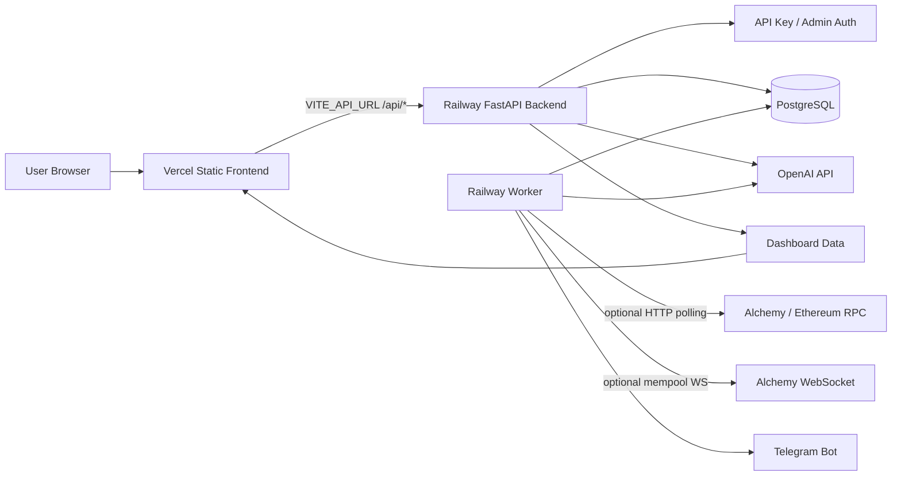
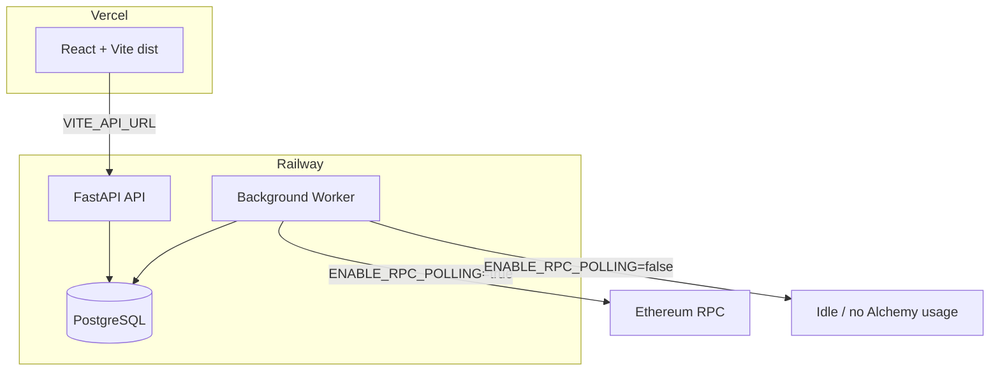
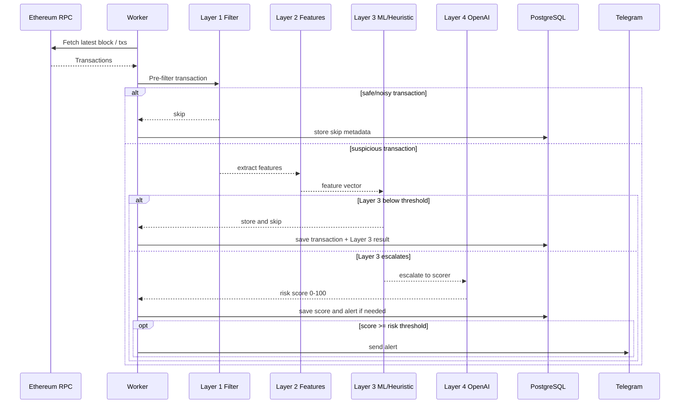
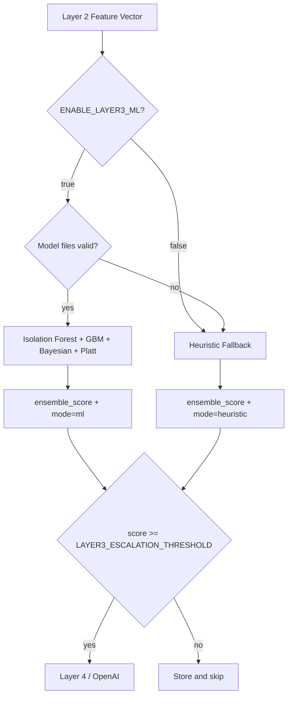

# Talosly — DeFi Security Alert System

> AI monitors your protocol 24/7. Risk scores every transaction 0-100.
> Fires Telegram alerts before hacks complete. Free beta.

## What Is Talosly?

Talosly is an automated DeFi security monitoring system. Add your Ethereum
contract address. Talosly watches transactions hitting your protocol, scores
each one for risk using OpenAI GPT-4o-mini, and sends instant Telegram alerts for
anything suspicious.

Most protocols cannot afford enterprise security monitoring before they have
serious traction. Talosly gives early teams a focused security alert layer they
can run before they raise.

## How It Works

1. Add your protocol's contract address to Talosly.
2. The monitoring worker checks Ethereum activity when RPC polling is enabled.
3. Layer 1 filters obvious safe/noisy transactions.
4. Layer 2 extracts exploit-oriented transaction features.
5. Layer 3 routes high-risk transactions using ML models or heuristic fallback.
6. Layer 4 / OpenAI scoring produces a 0-100 risk score for escalated transactions.
7. Score above 70 creates an alert and sends Telegram notification.
8. Full transaction and alert history is available on the dashboard.

## Tech Stack

- **Backend:** Python 3.11 + FastAPI
- **Worker:** Python asyncio polling loop
- **Database:** PostgreSQL
- **Frontend:** React 18 + Vite
- **Risk Scoring:** Layer 3 ML/heuristics + OpenAI GPT-4o-mini escalation
- **Blockchain:** Ethereum JSON-RPC, Alchemy compatible
- **Alerts:** Telegram Bot API
- **Deploy:** Docker Compose

## Beta Access

Talosly is currently in free beta. Apply from the landing page.

## Running Locally

### Prerequisites

- Docker + Docker Compose
- Alchemy API key or Ethereum RPC URL
- OpenAI API key
- Telegram bot token and chat ID

### Setup

```bash
cp .env.example .env
# Fill in your API keys in .env
cd frontend && npm install && npm run build && cd ..
docker compose up -d
```

Initialize the database:

```bash
docker compose exec backend python scripts/init_db.py
```

Create your first API key:

```bash
docker compose exec backend python scripts/create_api_key.py --name "Dev key"
```

Open:

- Frontend: http://localhost
- API health: http://localhost/api/health
- Dashboard: http://localhost/dashboard
- Admin: http://localhost/admin

## API

Health and waitlist routes are public. Product API routes require:

```text
Authorization: Bearer tals_xxxxx
```

Examples:

```bash
curl http://localhost/api/health
```

```bash
curl -X POST http://localhost/api/protocols \
  -H "Authorization: Bearer tals_xxxxx" \
  -H "Content-Type: application/json" \
  -d '{"name": "Uniswap V3", "address": "0xE592427A0AEce92De3Edee1F18E0157C05861564"}'
```

```bash
curl "http://localhost/api/transactions?protocol_id=1" \
  -H "Authorization: Bearer tals_xxxxx"
```

```bash
curl http://localhost/api/alerts \
  -H "Authorization: Bearer tals_xxxxx"
```

## Admin

Admin endpoints require:

```text
X-Admin-Secret: your_admin_secret
```

Admin can:

- list waitlist applications
- approve/reject beta access
- generate one-time API keys
- revoke API keys
- view metrics and usage

## Architecture



### Deployment Split



### Transaction Workflow



### Layer 3 Scoring Modes



### Runtime Controls

For Railway worker deployments:

```env
ENABLE_RPC_POLLING=false
POLL_INTERVAL_SECONDS=3600
ETHEREUM_BLOCKS_PER_POLL=1
ETHEREUM_INITIAL_LOOKBACK_BLOCKS=0
ETHEREUM_RPC_MIN_INTERVAL_SECONDS=5.0
ETHEREUM_RPC_MAX_RETRIES=1
ETHEREUM_RPC_RATE_LIMIT_BACKOFF_SECONDS=3600

ENABLE_LAYER3_ML=true
LAYER3_MODEL_DIR=models
LAYER3_ESCALATION_THRESHOLD=0.55
```

For Vercel frontend deployments:

```env
VITE_API_URL=https://talosly-startup-production.up.railway.app
```

## Development Checks

```bash
python3 -m pytest tests/
cd frontend && npm run build
```

## Status

Talosly v0.2.0 is a free beta launch build. It is designed for early user
testing, accelerator demos, and low-cost monitoring experiments.

Built with Codex. Monitoring DeFi so you do not have to.
