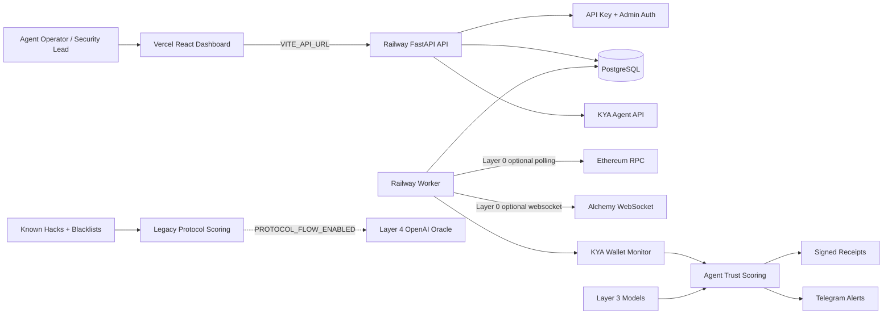
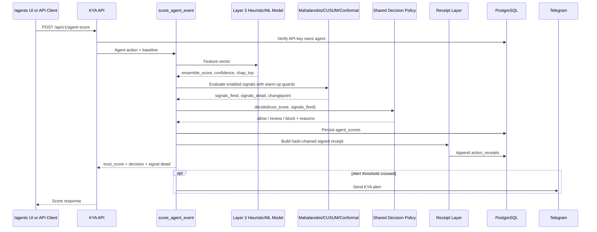
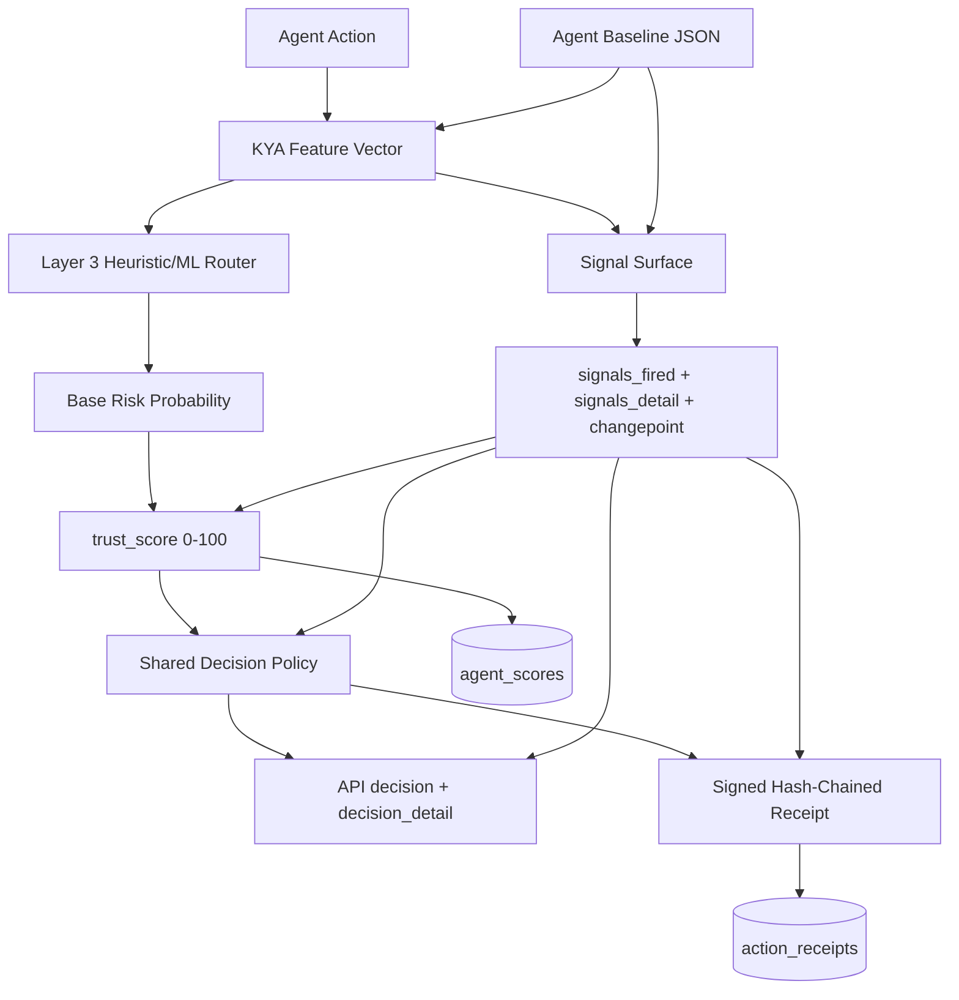
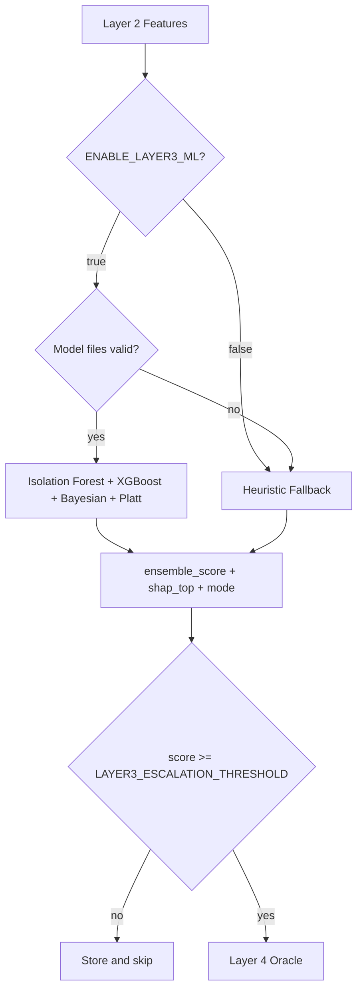
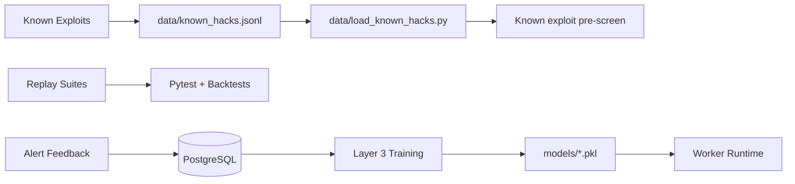
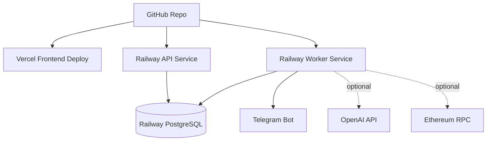

# Talosly

AI security monitoring for autonomous agent wallets.

Talosly watches registered agent wallets, builds behavioral baselines, extracts
explainable risk signals, records signed scoring evidence, and sends actionable
alerts before teams miss critical activity.

The current product surface is the agent-wallet flow. The legacy protocol
monitoring and replay flow still exists in the codebase, but it is dormant by
default behind `PROTOCOL_FLOW_ENABLED=false`.

## Product Snapshot

Talosly is a security command center for teams operating autonomous wallets.

The default operational loop is:

1. Register an agent wallet.
2. Ingest or submit wallet activity.
3. Build and update behavioral baselines.
4. Score activity with deterministic KYA logic and differentiated signals.
5. Store trust scores, decisions, receipts, alerts, and feedback.
6. Notify operators through Telegram.
7. Improve detection with tests and known exploit data.

This repo is not a landing page mock. It contains the backend, frontend,
worker, scoring stack, replay tools, tests, deployment config, and operating
playbook used to run Talosly.

## Why This Matters

Agent-wallet security is still mostly reactive for small teams. An autonomous
wallet can run with reviews and still miss the moment behavior breaks from its
normal counterparty, selector, value, cadence, or time-of-day profile.

The enterprise products in this category are powerful but expensive, heavy, and
not always built for founders who need fast setup and understandable alerts.
Talosly starts with a narrower, practical promise:

- monitor the wallets a team cares about,
- explain why an action looks risky,
- alert through channels teams already use,
- keep cost controlled through staged routing,
- preserve enough evidence for review and model improvement.

## Product Surface

Talosly currently includes:

- React dashboard for landing, agent-wallet monitoring, and admin views.
- FastAPI backend with API key auth, admin auth, rate limiting, and settings.
- Railway worker for live monitoring and alerting.
- PostgreSQL persistence for protocols, transactions, alerts, feedback, waitlist,
  settings, API keys, agent wallets, KYA scores, receipts, and scoring metrics.
- Telegram alert delivery with batching, retries, dedupe, and HTML fallback.
- Replay scripts for historical exploit-style testing.
- Known exploit transaction database and loader.
- Agent scoring with behavioral baselines, signal surfacing, shared decisions,
  and signed receipts.
- Legacy protocol transaction scoring behind `PROTOCOL_FLOW_ENABLED=false` by
  default, with optional Layer 4 LLM calls behind `LAYER4_LLM_ENABLED=false`.
- Deployment split for Vercel frontend and Railway backend/worker.

## System Overview



The architecture is intentionally split:

- **Vercel** serves only the static frontend.
- **Railway backend** serves `/api/*`.
- **Railway worker** runs background monitoring and alerting.
- **PostgreSQL** stores operational state.
- **RPC polling** can be turned off instantly with `ENABLE_RPC_POLLING=false`.
- **Layer 0 ingestion** covers raw RPC block polling and Alchemy mempool
  subscriptions before filtering, features, and scoring when those flags are
  enabled.
- **Protocol routes and demo replay** are registered only when
  `PROTOCOL_FLOW_ENABLED=true`.

## Current Agent Scoring Workflow



## Current Model

The active model is the KYA agent trust scorer. It converts an agent action into
behavioral features, scores the action with the existing Layer 3 heuristic/ML
router, overlays differentiated signals, and records the exact decision in both
the API response and the signed receipt.



Current KYA model components:

- feature vector: counterparty, selector, value, cadence, off-hours, and Layer 3
  compatible transaction features,
- baseline state: rolling robust stats, CUSUM state, conformal calibration, and
  event count,
- Layer 3 router: heuristic fallback or Isolation Forest + XGBoost + Bayesian
  updater + Platt calibration when model files are enabled and valid,
- signal surface: Mahalanobis, CUSUM changepoint, and conformal anomaly results,
- warm-up guards: new agents surface signals as `warming_up` without firing,
- decision policy: deterministic `allow`, `review`, or `block` annotation,
- receipt layer: Ed25519-signed, hash-chained evidence for the same decision the
  partner received.

The older protocol transaction pipeline still exists for replay and protocol
analysis, but it is not the default product path. Its routers are registered only
when `PROTOCOL_FLOW_ENABLED=true`, and Layer 4 OpenAI calls are made only when
`LAYER4_LLM_ENABLED=true`.

## Legacy Protocol Scoring Components

### Layer 1: Pre-Filter

Layer 1 rejects obvious safe or low-value paths before heavier work.

Operational profile:

- O(1) per transaction,
- zero LLM cost,
- intended to run before feature extraction or model inference.

Examples:

- known safe routers,
- selector whitelist checks,
- high-value movement threshold checks,
- routine low-risk calls,
- protocol-specific safe behavior,
- blacklisted addresses,
- known exploit target checks.

The scoring pre-filter uses a `pybloom-live` `ScalableBloomFilter` as a fast
negative precheck for address blacklist membership, then confirms matches
against an in-memory Python set before escalating. The set remains the exact
source of truth, so Bloom false positives do not become blacklist matches.

### Layer 2: Feature Engineering

Layer 2 converts transaction context into exploit-oriented features:

- graph centrality,
- sender velocity,
- pool drain ratio,
- flash loan fingerprint,
- wallet age,
- mixer tag,
- calldata entropy,
- gas anomaly z-score.

Implementation: `scoring/features.py`.

### Layer 3: ML or Heuristic Router

Layer 3 decides whether a transaction deserves expensive Layer 4 analysis.

Modes:

- `ml`: Isolation Forest + XGBoost classifier + Bayesian updater + Platt
  calibration.
- `heuristic`: pure-Python fallback with the same output schema.

Operational profile:

- no LLM cost,
- Isolation Forest anomaly score: approximately 1 ms per transaction,
- XGBoost classifier probability: approximately 3 ms per transaction,
- Bayesian update: approximately 0.1 ms per transaction.

If model files are missing, corrupt, or from the older Gradient Boosting format,
the worker falls back to heuristic mode instead of crashing. Retraining writes
XGBoost-backed model payloads through joblib.



Layer 3 fields:

- `ensemble_score`
- `confidence_low`
- `confidence_high`
- `escalate_to_llm`
- `isolation_score`
- `gbm_prob`
- `bayesian_prob`
- `shap_top`
- `mode`
- `latency_ms`

`shap_top` contains the top Layer 3 risk signals and is surfaced in the
frontend transaction detail modal as a compact signal breakdown when available.

## KYA Agent Wallet Monitoring

Talosly can monitor autonomous agent wallets through the `/agents` page. This
is a real backend-backed flow, not demo data.

An authenticated beta user can:

1. Connect a Talosly API key.
2. Register an Ethereum or Base agent wallet.
3. See only agents owned by that API key.
4. Watch monitoring status move from `pending` to `active` after the worker has
   ingested or scored activity for the wallet.
5. Send a Telegram test alert to confirm delivery.
6. Review the latest trust score, risk factors, and explanation signals.

Agent registration validates EVM wallet addresses as `0x` followed by 40
hexadecimal characters. Duplicate wallet addresses return a conflict without
leaving an orphaned agent record.

The KYA worker reads active wallets from `agent_wallets`, builds per-agent
behavioral baselines, persists scores, and sends alerts through the existing
Telegram service. Agent reads and scoring endpoints are scoped to the
requesting API key.

KYA state remains additive inside the existing `agent_profiles.baseline` JSON:

- `robust_stats` for rolling median, MAD, and robust covariance,
- `cusum_state` for changepoint accumulators,
- `conformal_calib` for conformal score calibration.

KYA signal flags are independently configurable. The master `ENABLE_KYA` gate
is off by default, while Mahalanobis, changepoint, and conformal signals default
to enabled once KYA scoring is turned on.

### Layer 4: Structured Oracle

Layer 4 receives Layer 2 features and Layer 3 signals, then returns a structured
security assessment when `LAYER4_LLM_ENABLED=true`.

Layer 4 is intentionally conditional and expensive relative to the earlier
layers. It is disabled by default in the agent path and must be explicitly
enabled for protocol transaction analysis.

Fields:

- `exploit_probability`
- `confidence`
- `verdict`
- `reasoning`
- `attack_type`
- `sub_signals`
- `recommended_action`
- `cost_usd`
- `fallback_used`
- `layer3_score`

Layer 4 is fail-open in the protocol transaction path: if OpenAI is disabled,
slow, rate-limited, unavailable, or returns malformed JSON, Talosly keeps the
transaction alert-worthy instead of silently suppressing a possible exploit.

Implementation: `scoring/layer4.py`.

### Layer 4 Risk Scorer

The existing `TransactionScorer` produces the final human-readable risk object:

```python
{
    "tx_hash": "0x...",
    "risk_score": 0-100,
    "risk_summary": "...",
    "risk_factors": ["..."]
}
```

Implementation: `backend/services/scorer.py`.

### Layer 5: Alert Orchestrator

Layer 5 centralizes the final alert decision and delivery.

It handles:

- final threshold routing,
- Layer 4 score enrichment,
- high-confidence benign suppression,
- fail-open fallback alerts,
- same-transaction dedupe,
- score persistence,
- alert row creation,
- Telegram send,
- `telegram_sent` marking,
- `/v1/risk` oracle API output for downstream consumers.

Implementation: `scoring/layer5.py`.

## Data and Feedback Loop



Talosly includes:

- `data/known_hacks.jsonl` for confirmed exploit hashes,
- `data/load_known_hacks.py` for O(1) exploit lookup and CLI updates,
- `scripts/train_layer3.py` for offline XGBoost Layer 3 training,
- replay scripts for validating detection behavior,
- alert feedback endpoints for human review.

Add a confirmed incident:

```bash
python3 data/load_known_hacks.py add \
  --hash 0xREAL_TX_HASH \
  --protocol "Protocol Name" \
  --chain ethereum \
  --amount 5000000 \
  --attack flash_loan \
  --source "ChainSec"
```

Train Layer 3:

```bash
python3 scripts/train_layer3.py \
  --tx-file data/transactions.jsonl \
  --hack-file data/known_hacks.jsonl \
  --model-dir models/
```

Smoke-test training:

```bash
python3 scripts/train_layer3.py --synthetic
```

## Dashboard and API

The frontend provides:

- landing page,
- agent-wallet registration and monitoring,
- KYA trust score, risk factor, changepoint, and signal detail views,
- admin settings,
- system status.

The backend exposes:

- health checks,
- agent-wallet registration and scoring,
- protocol CRUD and protocol-scoped transaction scoring when
  `PROTOCOL_FLOW_ENABLED=true`,
- alert listing,
- alert feedback,
- waitlist and admin routes.

Health check:

```bash
curl https://talosly-startup-production.up.railway.app/api/health
```

Expected:

```json
{"status":"ok","service":"Talosly"}
```

Product routes require:

```text
Authorization: Bearer tals_xxxxx
```

Admin routes require:

```text
X-Admin-Secret: your_admin_secret
```

## Deployment



### Runtime Boundaries

Authoritative application code lives in:

- `backend/main.py` for the FastAPI app,
- `backend/routers/` for API resources,
- `backend/services/scorer.py` for production transaction scoring,
- `backend/worker.py` for background monitoring,
- `frontend/src/` for the React dashboard.

The files under `api/` are thin Vercel route adapters that import
`backend.main.app`; they are not separate API implementations.

Runtime code should use `backend.services.scorer.TransactionScorer`.

### Vercel Frontend

Vercel should deploy only the React frontend.

Required variable:

```env
VITE_API_URL=https://talosly-startup-production.up.railway.app
```

Vercel build settings:

```json
{
  "installCommand": "cd frontend && npm install",
  "buildCommand": "cd frontend && npm run build",
  "outputDirectory": "frontend/dist"
}
```

`.vercelignore` excludes backend, ML, model, and runtime files so Vercel does
not bundle Python dependencies like `numpy` and `scikit-learn`.

### Railway Backend

The backend serves FastAPI.

Important variables:

```env
DATABASE_URL=...
OPENAI_API_KEY=...
OPENAI_MODEL=gpt-4o-mini
ADMIN_SECRET=...
API_KEY_SECRET_SALT=...
FRONTEND_URL=https://your-vercel-domain.vercel.app
PUBLIC_URL=https://talosly-startup-production.up.railway.app
PROTOCOL_FLOW_ENABLED=false
LAYER4_LLM_ENABLED=false
```

### Railway Worker

The worker runs `backend/worker.py`.

Safe current variables:

```env
ENABLE_RPC_POLLING=false
POLL_INTERVAL_SECONDS=3600

ETHEREUM_BLOCKS_PER_POLL=1
ETHEREUM_INITIAL_LOOKBACK_BLOCKS=0
ETHEREUM_RPC_MIN_INTERVAL_SECONDS=5.0
ETHEREUM_RPC_MAX_RETRIES=1
ETHEREUM_RPC_RATE_LIMIT_BACKOFF_SECONDS=3600

ENABLE_LAYER3_ML=true
LAYER3_MODEL_DIR=models
LAYER3_ESCALATION_THRESHOLD=0.55

LAYER4_ENABLED=false
LAYER4_MODEL=gpt-4o-mini
LAYER4_TIMEOUT_SECONDS=8
LAYER4_MAX_TOKENS=600
LAYER4_COST_LOG_FILE=logs/layer4_costs.jsonl
LAYER4_LLM_ENABLED=false

LAYER5_DEDUPE_WINDOW_S=300
LAYER5_CONFIDENCE_GATE=true

RISK_ALERT_THRESHOLD=70
TELEGRAM_BOT_TOKEN=...
TELEGRAM_CHAT_ID=...

ENABLE_KYA=true
KYA_POLL_INTERVAL_SECONDS=3600
KYA_ALERT_THRESHOLD=80
KYA_SUPPORTED_CHAINS=ethereum,base

KYA_ENABLE_MAHALANOBIS=true
KYA_ENABLE_CHANGEPOINT=true
KYA_ENABLE_CONFORMAL=true

KYA_W_BASE=0.85
KYA_W_MAHALANOBIS=0.10
KYA_W_CHANGEPOINT=0.05
KYA_CUSUM_DRIFT=0.01
KYA_CUSUM_THRESHOLD=0.25
KYA_CONFORMAL_ALPHA=0.05
```

Expected healthy idle logs:

```text
worker.start ... rpc_polling=false
worker.layer0.rpc.start
worker.poll.disabled ... reason="rpc polling disabled"
```

When the Alchemy mempool subscriber is enabled and a websocket URL is present,
Layer 0 also logs:

```text
worker.layer0.mempool.start
```

To resume live polling:

```env
ENABLE_RPC_POLLING=true
ENABLE_MEMPOOL_SUBSCRIBER=false
```

Keep the mempool subscriber off unless the Alchemy plan supports
`alchemy_pendingTransactions`. Repeating `server rejected WebSocket connection:
HTTP 429` means the websocket subscription is rate-limited; RPC polling can
still run without it.

Use one worker replica unless multiple consumers are intentionally sharing RPC
quota.

### KYA Deployment Checklist

To make agent wallet monitoring live:

1. Deploy the backend and frontend changes.
2. Run Alembic migrations so `agents.owner_api_key_id` exists.
3. Set `ENABLE_KYA=true` on the worker service.
4. Configure `DATABASE_URL`, an Ethereum RPC endpoint, `TELEGRAM_BOT_TOKEN`, and
   `TELEGRAM_CHAT_ID`.
5. Restart or redeploy the worker after changing environment variables.
6. Register a controlled wallet from `/agents`, send a test alert, and confirm
   monitoring status becomes `active` after activity is processed.

The KYA signal flags are independent rollback switches. Leave `ENABLE_KYA=false`
until the agent flow is intentionally live; once enabled, new agents warm up
signals before they can fire.

## RPC Safety and Rate Limits

During production testing, Alchemy returned `429 Too Many Requests` even for
`eth_blockNumber`. Talosly now includes:

- RPC polling kill switch,
- optional Alchemy pending-transaction websocket ingestion,
- sanitized RPC errors that do not leak keys,
- bounded retries,
- long cooldown after hard rate limit,
- per-request throttling,
- block transaction cache,
- configurable block range,
- no startup backfill by default.

If the worker logs `worker.rpc.rate_limited`, set:

```env
ENABLE_RPC_POLLING=false
```

Then redeploy the Railway worker. The correct idle log is:

```text
worker.poll.disabled
```

## Local Development

Prerequisites:

- Python 3.11+
- Node.js
- Docker and Docker Compose
- PostgreSQL or Docker Compose
- OpenAI API key only if optional Layer 4 LLM scoring is enabled
- Telegram bot token and chat ID for live notifications
- Alchemy/RPC key only if live polling is enabled

Setup:

```bash
cp .env.example .env
cd frontend && npm install && npm run build && cd ..
docker compose up -d
```

Initialize database:

```bash
docker compose exec backend python scripts/init_db.py
```

Create an API key:

```bash
docker compose exec backend python scripts/create_api_key.py --name "Dev key"
```

Open locally:

- Frontend: `http://localhost`
- API health: `http://localhost/api/health`
- Agent wallets: `http://localhost/agents`
- Admin: `http://localhost/admin`

## Testing and Verification

Run all tests:

```bash
.venv/bin/python -m pytest
```

Current local result from this pass:

```text
186 passed, 4 warnings
```

Focused checks:

```bash
.venv/bin/python -m pytest tests/test_layer3.py tests/test_layer4.py tests/test_layer5.py
.venv/bin/python -m pytest tests/test_scorer.py tests/test_rpc.py tests/test_known_hacks.py
.venv/bin/python -m pytest tests/test_telegram.py tests/test_api.py
.venv/bin/python -m pytest tests/test_kya_api.py tests/test_kya_ownership.py tests/test_kya_validation.py tests/test_kya_test_alert.py
```

Build frontend:

```bash
cd frontend && npm run build
```

Replay or demo flows:

```bash
python3 replay_suite.py
python3 replay_hack.py
```

## Project Structure

```text
backend/
  main.py                  FastAPI app
  worker.py                monitoring worker
  database.py              PostgreSQL access layer
  config.py                environment settings
  services/
    scorer.py              risk scoring and pre-screening
    rpc.py                 Ethereum RPC client with backoff
    telegram.py            Telegram delivery and batching
    blacklist.py           malicious addresses and exploit targets
  routers/                 API routes

kya/
  api.py                   owner-scoped agent registration and scoring API
  baselines.py             rolling per-agent behavioral profile
  score.py                 KYA trust scoring and optional signal fusion
  alerts.py                KYA Telegram alert delivery
  signals/                 Mahalanobis, changepoint, and conformal signals

scoring/
  filters.py              Layer 1 pre-filter with Bloom-backed exact blacklist
  features.py              Layer 2 feature extraction
  layer3.py                XGBoost ML/heuristic router
  layer4.py                structured LLM oracle
  layer5.py                alert orchestrator
  hybrid_engine.py         hybrid scoring experiments
  cost_tracker.py          LLM usage tracking

data/
  known_hacks.jsonl        known exploit transaction hashes
  load_known_hacks.py      known-hacks loader and CLI
  transactions.jsonl       sample training data

scripts/
  train_layer3.py          offline XGBoost model training
  init_db.py               database initialization
  create_api_key.py        API key creation

frontend/
  src/
    pages/                 landing, agents, admin, and dormant legacy pages
    components/            UI components

tests/
  test_layer3.py           Layer 3 routing and fallback tests
  test_layer4.py           Layer 4 oracle tests
  test_layer5.py           alert orchestration tests
  test_rpc.py              RPC rate-limit behavior
  test_scorer.py           scorer behavior
  test_telegram.py         Telegram delivery behavior
  test_kya_*.py            KYA onboarding, ownership, signals, and alerts
```

## What Is Working Now

- Railway backend health endpoint is live.
- Vercel frontend builds as a static app.
- Worker boots in production.
- RPC polling can be safely disabled.
- Known exploit DB loads.
- Blacklist loads.
- Layer 3 bootstraps and scores.
- Layer 4 has structured fail-open behavior.
- Layer 5 centralizes alert persistence and Telegram delivery.
- Agent wallets can be registered from the website and are scoped to the
  requesting API key.
- Agent monitoring status and Telegram test-alert confirmation are available on
  `/agents`.
- Full test suite passes locally.

## What Comes Next

Near-term product work:

- Add more verified historical exploit hashes.
- Run structured replay suites against known incidents.
- Expand protocol-specific parsers.
- Add alert detail views for Layer 3/4/5 explanations.
- Persist Layer 3 and Layer 4 metadata in richer DB columns.
- Improve wallet and contract reputation signals.
- Add per-protocol alert policies.
- Add self-service beta approval and per-user alert destinations.

Near-term business work:

- Record a concise Loom demo.
- Onboard a small number of design partners.
- Validate alert quality with historical and live protocol traffic.
- Convert replay evidence into case studies.
- Package Talosly as a lightweight DeFi security co-pilot.

## Market Positioning

Talosly is infrastructure for crypto-native teams, built around a real
operational pain: early-stage DeFi protocols need security monitoring before
they have security headcount.

The product has a narrow wedge, a clear buyer, and room to compound:

- start with monitored contracts and Telegram alerts,
- become the dashboard for agent-wallet risk operations,
- use replay and feedback to improve detection,
- expand from Ethereum to multi-chain monitoring,
- package risk intelligence for protocols, funds, auditors, and ecosystems.

The core bet is that AI security tools should not be generic chatbots. They
should be embedded in deterministic pipelines, use structured chain features,
fail safely, and create evidence operators can act on.

## Operating Principle

Talosly favors:

- layered detection over one-shot prediction,
- explainability over black-box alerts,
- cost gates before expensive inference,
- fail-open behavior for high-risk paths,
- replayable evidence,
- simple deployment controls,
- fast iteration with real users.
