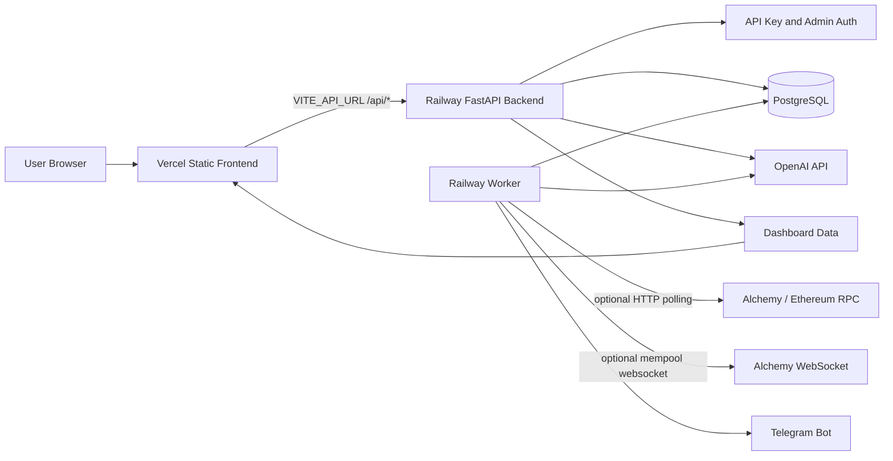
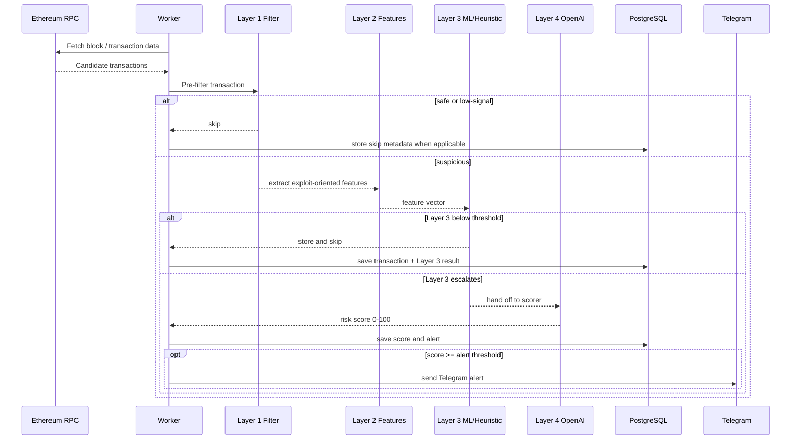
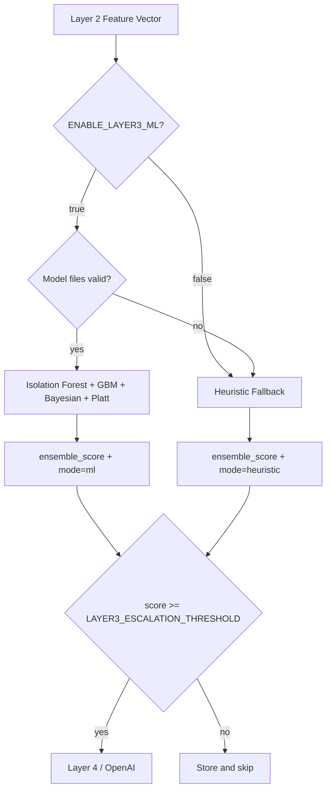

# Talosly

AI-powered DeFi security monitoring for early protocols.

Talosly watches protocol contracts, filters noisy chain activity, scores suspicious
transactions through a layered detection pipeline, and sends alerts before teams
miss critical on-chain signals.

> Built for small DeFi teams that need a lightweight security command center
> before they can afford enterprise monitoring.

## Product Snapshot

Talosly is a full-stack security monitoring system:

- Add a protocol contract address.
- Monitor Ethereum activity through a Railway worker.
- Filter low-signal transactions before expensive analysis.
- Extract exploit-oriented Layer 2 features.
- Route suspicious transactions with Layer 3 ML or heuristic fallback.
- Escalate high-risk transactions to an OpenAI-backed scorer.
- Store transactions, risk scores, alerts, feedback, and metrics in PostgreSQL.
- Notify teams through Telegram when risk crosses the configured threshold.
- Expose a React dashboard for protocols, alerts, transaction history, replay, and admin controls.

## Why This Exists

Most early DeFi protocols do not have a dedicated security operations team.
Their monitoring often comes from manual Etherscan checks, community messages, or
Twitter after the exploit is already public.

Talosly aims to provide a practical middle layer:

- cheaper than enterprise monitoring,
- faster than manual investigation,
- understandable enough for founders and small teams,
- extensible enough to become a serious security product.

## Current Production Shape

The app is split intentionally:

- **Vercel** serves only the static React frontend.
- **Railway backend** runs the FastAPI API.
- **Railway worker** runs background monitoring and alerting.
- **PostgreSQL** stores protocols, transactions, alerts, settings, waitlist entries, and API keys.
- **Alchemy / Ethereum RPC** is optional and can be disabled during rate-limit events.



## Live API Check

The Railway backend health endpoint should return:

```bash
curl https://talosly-startup-production.up.railway.app/api/health
```

```json
{"status":"ok","service":"Talosly"}
```

The Vercel frontend should point to that backend with:

```env
VITE_API_URL=https://talosly-startup-production.up.railway.app
```

## Transaction Pipeline

Talosly is designed as a staged pipeline so obvious noise is cheap, suspicious
behavior receives more context, and expensive model/API calls are used only when
needed.



## Scoring Layers

### Layer 1: Pre-Filter

Layer 1 rejects obvious safe or low-value paths before heavier work.

Examples:

- known safe routers,
- dust transactions,
- routine low-risk calls,
- safe protocol-specific behavior,
- blacklist and known exploit target checks.

### Layer 2: Feature Engineering

Layer 2 turns transaction context into a compact feature vector:

- graph centrality,
- sender velocity,
- pool drain ratio,
- flash loan fingerprint,
- wallet age,
- mixer tag,
- calldata entropy,
- gas anomaly z-score.

These features are defined in `scoring/features.py`.

### Layer 3: ML or Heuristic Router

Layer 3 decides whether a transaction deserves expensive Layer 4 analysis.

It supports two runtime modes:

- `ml`: Isolation Forest + Gradient Boosting + Bayesian updater + Platt calibration.
- `heuristic`: pure-Python fallback with the same output schema.

If model files are missing or corrupt, Layer 3 automatically falls back to
heuristic mode instead of crashing the worker.



Layer 3 result fields include:

- `ensemble_score`
- `confidence_low`
- `confidence_high`
- `escalate_to_llm`
- `isolation_score`
- `gbm_prob`
- `bayesian_prob`
- `shap_top`
- `mode`
- `latency_ms`

### Layer 4: OpenAI Risk Scoring

Layer 4 uses the existing `TransactionScorer` to produce a human-readable risk
score and explanation.

Output:

- `risk_score`: 0-100
- `risk_summary`
- `risk_factors`

When the score crosses `RISK_ALERT_THRESHOLD`, Talosly creates an alert and can
send a Telegram notification.

Talosly also includes a structured Layer 4 oracle in `scoring/layer4.py`. It is
called after Layer 3 escalates and before the existing scorer/alert path.

Layer 4 returns:

- `exploit_probability`
- `confidence`
- `verdict`
- `reasoning`
- `attack_type`
- `sub_signals`
- `recommended_action`
- `cost_usd`
- `fallback_used`
- `layer3_score`

Layer 4 is fail-open. If OpenAI is disabled, unavailable, slow, rate-limited, or
returns malformed JSON, Talosly keeps the transaction alert-worthy instead of
silently suppressing a possible exploit.

### Layer 5: Alert Orchestration

Layer 5 is the final alert gateway in `scoring/layer5.py`. It centralizes the
worker's DB persistence and Telegram delivery while reusing the existing
`backend.database` and `TelegramService` contracts.

Layer 5 handles:

- final threshold routing,
- Layer 4 score enrichment,
- high-confidence benign suppression,
- fail-open Layer 4 fallback alerts,
- same-transaction dedupe,
- DB score persistence,
- alert row creation,
- Telegram send and `telegram_sent` marking.

It returns an `AlertProcessResult` so the worker can still update metrics such
as `alerts_fired` without duplicating alert logic.

## Worker Behavior

The real worker is `backend/worker.py`.

Layer 3 is wired into the real worker:

- imported from `scoring.layer3`,
- initialized as `self.layer3 = Layer3MLEnsemble()`,
- used in mempool handling,
- used in RPC polling before OpenAI scoring.

Low Layer 3 scores are stored/skipped. High Layer 3 scores proceed toward the
Layer 4 oracle, the current `TransactionScorer`, and finally Layer 5 alert
orchestration.

## Alchemy Rate-Limit Protection

During production testing, Alchemy returned `429 Too Many Requests` even for
`eth_blockNumber`. Talosly now has multiple protections:

- sanitized RPC errors that do not leak the Alchemy URL or API key,
- request throttling,
- bounded retries,
- long cooldown after hard `429`,
- block transaction cache per poll,
- configurable blocks per poll,
- no startup backfill by default,
- full emergency switch with `ENABLE_RPC_POLLING=false`.

Recommended worker settings while quota is recovering:

```env
ENABLE_RPC_POLLING=false
POLL_INTERVAL_SECONDS=3600
ETHEREUM_BLOCKS_PER_POLL=1
ETHEREUM_INITIAL_LOOKBACK_BLOCKS=0
ETHEREUM_RPC_MIN_INTERVAL_SECONDS=5.0
ETHEREUM_RPC_MAX_RETRIES=1
ETHEREUM_RPC_RATE_LIMIT_BACKOFF_SECONDS=3600
```

Expected logs when RPC polling is disabled:

```text
worker.start ... rpc_polling=false
worker.poll.disabled
```

If `worker.rpc.rate_limited` still appears after redeploy, an old worker process
or another service is still using the same Alchemy key.

## Known Hacks Dataset

Talosly includes a local known-exploit transaction database:

- `data/known_hacks.jsonl`
- `data/load_known_hacks.py`

The loader accepts JSONL records and plain transaction hash lines, validates
real `0x` + 64-hex transaction hashes, and exposes O(1) lookup.

Check stats:

```bash
python3 data/load_known_hacks.py stats
```

Check a hash:

```bash
python3 data/load_known_hacks.py check 0x...
```

Add a confirmed incident:

```bash
python3 data/load_known_hacks.py add \
  --hash 0xREAL_TX_HASH \
  --protocol "Protocol Name" \
  --chain ethereum \
  --amount 5000000 \
  --attack flash_loan \
  --source "ChainSec"
```

The service uses this database in pre-screening. A known exploit transaction is
immediately scored as high-risk without needing an OpenAI call.

## Layer 3 Training

Offline training lives in:

- `scripts/train_layer3.py`
- `data/transactions.jsonl`
- `data/known_hacks.jsonl`

Smoke-test with synthetic data:

```bash
python3 scripts/train_layer3.py --synthetic
```

Train with local historical data:

```bash
python3 scripts/train_layer3.py \
  --tx-file data/transactions.jsonl \
  --hack-file data/known_hacks.jsonl \
  --model-dir models/
```

The trainer prints:

- classification report,
- AUC-ROC,
- AUC-PR,
- best F1 threshold,
- current threshold.

Use the printed best threshold to tune:

```env
LAYER3_ESCALATION_THRESHOLD=0.55
```

Model files:

- `models/isolation_forest.pkl`
- `models/gbm.pkl`
- `models/platt_scaler.pkl`

## Deployment

### Vercel Frontend

Vercel should deploy only the React frontend.

Required Vercel variable:

```env
VITE_API_URL=https://talosly-startup-production.up.railway.app
```

Vercel build settings:

```json
{
  "installCommand": "cd frontend && npm install",
  "buildCommand": "cd frontend && npm run build",
  "outputDirectory": "frontend/dist"
}
```

The `.vercelignore` file excludes backend, ML, model, and runtime files from
Vercel. This prevents the static frontend deploy from bundling Python
dependencies like `numpy` and `scikit-learn`.

Local frontend build size is small:

```text
frontend/dist ~= 264K
```

### Railway Backend

The Railway backend runs FastAPI and serves `/api/*`.

Important variables:

```env
DATABASE_URL=...
OPENAI_API_KEY=...
OPENAI_MODEL=gpt-4o-mini
ADMIN_SECRET=...
API_KEY_SECRET_SALT=...
FRONTEND_URL=https://your-vercel-domain.vercel.app
PUBLIC_URL=https://talosly-startup-production.up.railway.app
```

Health check:

```bash
curl https://talosly-startup-production.up.railway.app/api/health
```

### Railway Worker

The Railway worker runs `backend/worker.py`.

Recommended current variables:

```env
ENABLE_RPC_POLLING=false
POLL_INTERVAL_SECONDS=3600

ETHEREUM_BLOCKS_PER_POLL=1
ETHEREUM_INITIAL_LOOKBACK_BLOCKS=0
ETHEREUM_RPC_MIN_INTERVAL_SECONDS=5.0
ETHEREUM_RPC_MAX_RETRIES=1
ETHEREUM_RPC_RATE_LIMIT_BACKOFF_SECONDS=3600

ENABLE_LAYER3_ML=true
LAYER3_MODEL_DIR=models
LAYER3_ESCALATION_THRESHOLD=0.55
LAYER4_ENABLED=true
LAYER4_MODEL=gpt-4o-mini
LAYER4_TIMEOUT_SECONDS=8
LAYER4_MAX_TOKENS=600
LAYER4_COST_LOG_FILE=logs/layer4_costs.jsonl
LAYER5_DEDUPE_WINDOW_S=300
LAYER5_CONFIDENCE_GATE=true

RISK_ALERT_THRESHOLD=70
TELEGRAM_BOT_TOKEN=...
TELEGRAM_CHAT_ID=...
```

When you are ready to resume chain polling:

```env
ENABLE_RPC_POLLING=true
```

Use one worker replica unless you intentionally want multiple consumers sharing
the same RPC quota.

## API

Health and waitlist routes are public.

Product routes require:

```text
Authorization: Bearer tals_xxxxx
```

Admin routes require:

```text
X-Admin-Secret: your_admin_secret
```

Examples:

```bash
curl https://talosly-startup-production.up.railway.app/api/health
```

```bash
curl -X POST https://talosly-startup-production.up.railway.app/api/protocols \
  -H "Authorization: Bearer tals_xxxxx" \
  -H "Content-Type: application/json" \
  -d '{"name": "Uniswap V3", "address": "0xE592427A0AEce92De3Edee1F18E0157C05861564"}'
```

```bash
curl "https://talosly-startup-production.up.railway.app/api/transactions?protocol_id=1" \
  -H "Authorization: Bearer tals_xxxxx"
```

```bash
curl https://talosly-startup-production.up.railway.app/api/alerts \
  -H "Authorization: Bearer tals_xxxxx"
```

## Local Development

Prerequisites:

- Docker and Docker Compose
- Node.js
- Python 3.11+
- PostgreSQL or Docker Compose
- Alchemy API key if RPC polling is enabled
- OpenAI API key if Layer 4 scoring is enabled
- Telegram bot token and chat ID if alert delivery is enabled

Setup:

```bash
cp .env.example .env
cd frontend && npm install && npm run build && cd ..
docker compose up -d
```

Initialize database:

```bash
docker compose exec backend python scripts/init_db.py
```

Create an API key:

```bash
docker compose exec backend python scripts/create_api_key.py --name "Dev key"
```

Open locally:

- Frontend: `http://localhost`
- API health: `http://localhost/api/health`
- Dashboard: `http://localhost/dashboard`
- Admin: `http://localhost/admin`

## Development Checks

Run all tests:

```bash
python3 -m pytest
```

Run focused scoring tests:

```bash
python3 -m pytest tests/test_layer3.py tests/test_scorer.py tests/test_known_hacks.py
```

Run Layer 4 oracle tests:

```bash
python3 -m pytest tests/test_layer4.py
```

Run Layer 5 alert orchestration tests:

```bash
python3 -m pytest tests/test_layer5.py
```

Build frontend:

```bash
cd frontend && npm run build
```

Train Layer 3 smoke model:

```bash
python3 scripts/train_layer3.py --synthetic --model-dir /private/tmp/talosly-layer3-models
```

## Project Structure

```text
backend/
  main.py                 FastAPI app
  worker.py               background monitoring worker
  services/
    scorer.py             Layer 4 / OpenAI risk scoring
    rpc.py                Ethereum RPC client with backoff
    telegram.py           alert delivery
    blacklist.py          malicious addresses and exploit targets
  routers/                API routers

scoring/
  features.py             Layer 2 feature extraction
  layer3.py               ML/heuristic Layer 3 router
  layer4.py               structured Layer 4 oracle with fail-open fallback
  hybrid_engine.py        hybrid scoring experiments
  cost_tracker.py         LLM usage tracking

data/
  known_hacks.jsonl       known exploit transaction hashes
  load_known_hacks.py     dataset loader and CLI
  transactions.jsonl      sample training data

scripts/
  train_layer3.py         offline Layer 3 training
  init_db.py              database initialization
  create_api_key.py       API key creation

frontend/
  src/                    React dashboard and landing page
  dist/                   Vite production output

tests/
  test_layer3.py          Layer 3 routing and fallback tests
  test_layer4.py          Layer 4 oracle and fail-open tests
  test_scorer.py          transaction scorer tests
  test_rpc.py             RPC throttle/retry tests
  test_known_hacks.py     known hacks loader tests
```

## Troubleshooting

### Alchemy 429

Symptoms:

```text
worker.rpc.rate_limited
Ethereum RPC rate limited method 'eth_blockNumber'
```

Fix:

```env
ENABLE_RPC_POLLING=false
```

Then redeploy the Railway worker. If the log continues, stop old worker replicas
or rotate the Alchemy key.

### Vercel Bundle Too Large

Symptoms:

```text
Total bundle size exceeds the size limit
```

Fix:

- Vercel must not install Python dependencies.
- Use frontend-only install command.
- Keep `.vercelignore` excluding backend, scoring, data, models, and requirements.

### Frontend Cannot Reach API

Check Vercel variable:

```env
VITE_API_URL=https://talosly-startup-production.up.railway.app
```

Then redeploy Vercel.

### Layer 3 Model Missing

This is safe. The worker falls back to heuristic mode.

Check logs for:

```text
Layer 3 model files missing ... using heuristic mode
```

## Current Status

Talosly v0.2.0 is a beta launch build. It is designed for:

- early protocol monitoring,
- founder demos,
- accelerator applications,
- low-cost security experiments,
- iterative development toward a stronger DeFi security product.

The system is intentionally built with clear escape hatches:

- disable RPC polling when quota is tight,
- fall back to heuristics when model files are unavailable,
- keep Vercel frontend separate from backend ML dependencies,
- route expensive OpenAI calls only after lower-cost filters.

## Engineering Principles

Talosly favors:

- graceful degradation over crashes,
- cheap filters before expensive inference,
- explicit deployment boundaries,
- transparent logs and health checks,
- small operational controls that can be changed quickly in Railway/Vercel,
- test coverage around the failure modes that appeared during real deployment.
