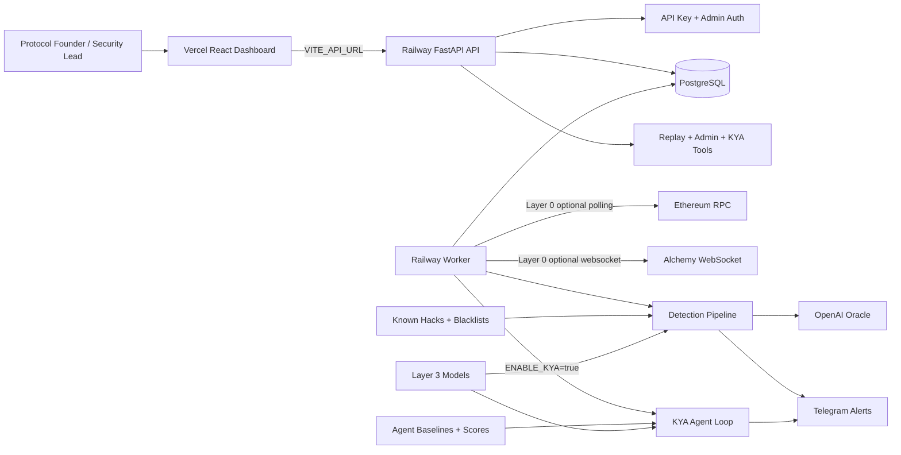
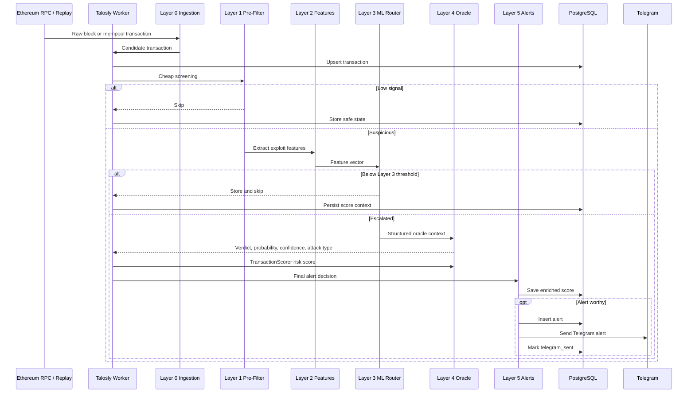
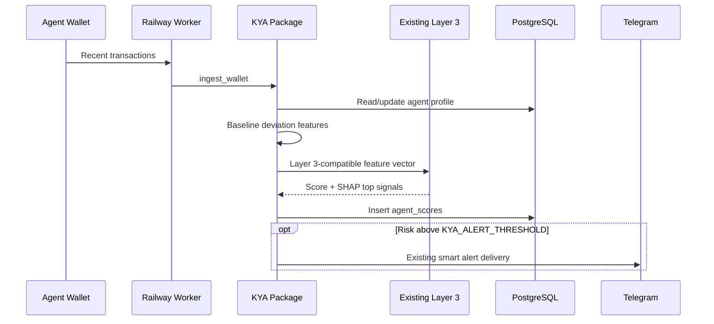
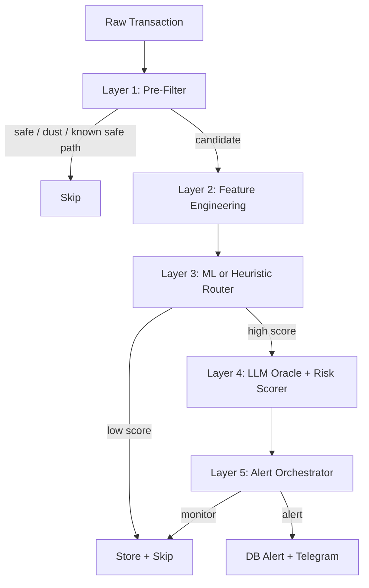
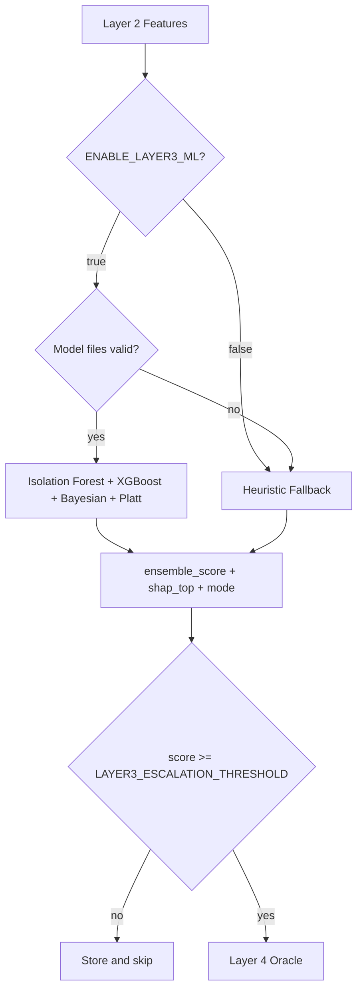
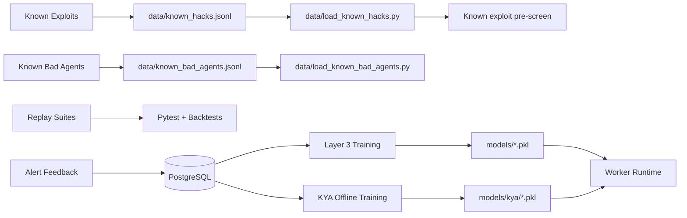
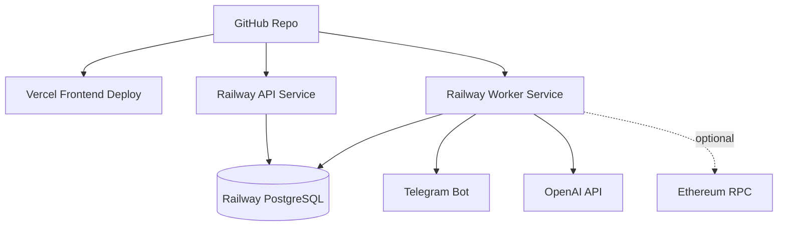

# Talosly

AI security monitoring for DeFi protocols and autonomous agents.

Talosly watches protocol contracts, filters noisy on-chain activity, extracts
exploit-oriented signals, uses ML and LLM reasoning only when needed, and sends
actionable alerts before teams miss critical transactions.

The same engine now also powers **KYA**: Know Your Agent, a default-off product
surface for real-time trust scoring of autonomous AI agents. KYA monitors an
agent wallet, learns a rolling behavioral baseline, scores deviations with the
existing Layer 3 machinery and SHAP explanations, and alerts through the same
Telegram delivery path.

The product is built for early DeFi teams that cannot yet afford a full
security operations team, but still need practical monitoring, explainable risk
scores, alert history, replayable evidence, and agent-level operational trust.

## Product Snapshot

Talosly is a security command center for small and mid-stage DeFi teams.

The wedge is simple: most early protocols monitor risk manually through
Etherscan, Discord, Telegram, Twitter, and scattered dashboards. Talosly turns
that into one operational loop:

1. Add a protocol contract.
2. Monitor live or replayed chain activity.
3. Filter obvious noise cheaply.
4. Score suspicious behavior with layered ML, heuristics, and LLM analysis.
5. Store transactions, scores, alerts, and feedback.
6. Notify operators through Telegram.
7. Improve detection with replay tests and known exploit data.

KYA is additive. The existing protocol-monitoring path remains the production
default and KYA runtime behavior is disabled unless `ENABLE_KYA=true`.

This repo is not a landing page mock. It contains the backend, frontend,
worker, scoring stack, KYA agent trust package, replay tools, tests, deployment
config, and operating playbook used to run Talosly.

## Why This Matters

DeFi security is still mostly reactive for small teams. A protocol can ship with
audits and still miss the moment a dangerous transaction touches a pool, vault,
bridge, router, or governance contract.

The enterprise products in this category are powerful but expensive, heavy, and
not always built for founders who need fast setup and understandable alerts.
Talosly starts with a narrower, practical promise:

- monitor the contracts a team cares about,
- explain why a transaction looks risky,
- alert through channels teams already use,
- keep cost controlled through staged routing,
- preserve enough evidence for review and model improvement.

## Product Surface

Talosly currently includes:

- React dashboard for protocols, transactions, alerts, replay, agents, and
  admin views.
- FastAPI backend with API key auth, admin auth, rate limiting, and settings.
- Railway worker for live monitoring and alerting.
- PostgreSQL persistence for protocols, transactions, alerts, feedback, waitlist,
  settings, API keys, scoring metrics, agents, agent wallets, agent profiles,
  and agent scores.
- Telegram alert delivery with batching, retries, dedupe, and HTML fallback.
- Replay scripts for historical exploit-style testing.
- Known exploit transaction database and loader.
- Known bad-agent label loader and offline KYA training script.
- Layered scoring engine from cheap filters to LLM oracle.
- KYA package for agent wallet ingestion, baselines, feature adaptation,
  scoring, alerts, API routes, and offline training.
- Deployment split for Vercel frontend and Railway backend/worker.

## System Overview



The architecture is intentionally split:

- **Vercel** serves only the static frontend.
- **Railway backend** serves `/api/*`.
- **Railway worker** runs background monitoring and alerting.
- **PostgreSQL** stores operational state.
- **RPC polling** can be turned off instantly with `ENABLE_RPC_POLLING=false`.
- **Layer 0 ingestion** covers raw RPC block polling and Alchemy mempool
  subscriptions before filtering, features, and scoring.
- **KYA ingestion** is off by default and runs only in the Railway worker when
  `ENABLE_KYA=true`.

## End-to-End Detection Workflow



## KYA Agent Trust Workflow

KYA is a second product path built on the same Talosly engine. It is designed
for design partners running autonomous agents that control or propose on-chain
actions.

The current KYA v1 loop:

1. Register an agent and connect a wallet.
2. Ingest recent wallet activity through the existing Ethereum RPC client.
3. Normalize each transaction into an `AgentEvent`.
4. Update the rolling `agent_profiles` behavioral baseline.
5. Build a Layer 3-compatible feature vector with extra KYA deviation signals.
6. Score the event with the existing Layer 3 ML/heuristic machinery.
7. Persist trust scores and SHAP top signals in `agent_scores`.
8. Alert through the existing Telegram service if derived risk crosses
   `KYA_ALERT_THRESHOLD`.



KYA v1 runs unsupervised by default. It can optionally use an offline-trained
model from `models/kya`, but if model files are absent or invalid it falls back
to the same no-model Layer 3 behavior Talosly already uses safely.

The main product risk is false positives. Let a design partner wallet baseline
for a few days before treating alerts as production-grade. If early alerts are
noisy, tighten the baseline confidence gate before adding more features.

## Scoring Stack

Talosly is built as a staged pipeline so cheap decisions happen first and
expensive inference is reserved for higher-signal transactions.



### Layer 1: Pre-Filter

Layer 1 rejects obvious safe or low-value paths before heavier work.

Operational profile:

- O(1) per transaction,
- zero LLM cost,
- intended to run before feature extraction or model inference.

Examples:

- known safe routers,
- selector whitelist checks,
- high-value movement threshold checks,
- dust transactions,
- routine low-risk calls,
- protocol-specific safe behavior,
- blacklisted addresses,
- known exploit target checks.

The scoring pre-filter uses a real probabilistic Bloom filter for address
blacklist membership (`pybloom-live`, capacity 100,000, false-positive rate
0.1%). The backend service blacklist remains a plain Python set for exact
application-level lookups.

### Layer 2: Feature Engineering

Layer 2 converts transaction context into exploit-oriented features:

- graph centrality,
- sender velocity,
- pool drain ratio,
- flash loan fingerprint,
- wallet age,
- mixer tag,
- calldata entropy,
- gas anomaly z-score.

Implementation: `scoring/features.py`.

### Layer 3: ML or Heuristic Router

Layer 3 decides whether a transaction deserves expensive Layer 4 analysis.

Modes:

- `ml`: Isolation Forest + XGBoost classifier + Bayesian updater + Platt
  calibration.
- `heuristic`: pure-Python fallback with the same output schema.

Operational profile:

- no LLM cost,
- Isolation Forest anomaly score: approximately 1 ms per transaction,
- XGBoost classifier probability: approximately 3 ms per transaction,
- Bayesian update: approximately 0.1 ms per transaction.

If model files are missing, corrupt, or from the older Gradient Boosting format,
the worker falls back to heuristic mode instead of crashing. Retraining writes
XGBoost-backed model payloads through joblib.



Layer 3 fields:

- `ensemble_score`
- `confidence_low`
- `confidence_high`
- `escalate_to_llm`
- `isolation_score`
- `gbm_prob`
- `bayesian_prob`
- `shap_top`
- `mode`
- `latency_ms`

`shap_top` contains the top Layer 3 risk signals and is surfaced in the
frontend transaction detail modal as a compact signal breakdown when available.

### Layer 4: Structured Oracle

Layer 4 receives Layer 2 features and Layer 3 signals, then returns a structured
security assessment.

Layer 4 is intentionally conditional and expensive relative to the earlier
layers. In the target routing profile, only about 5% of transactions reach the
oracle path, with an approximate marginal LLM cost around $0.02 per analyzed
transaction depending on model, token use, and provider pricing.

Fields:

- `exploit_probability`
- `confidence`
- `verdict`
- `reasoning`
- `attack_type`
- `sub_signals`
- `recommended_action`
- `cost_usd`
- `fallback_used`
- `layer3_score`

Layer 4 is fail-open: if OpenAI is disabled, slow, rate-limited, unavailable, or
returns malformed JSON, Talosly keeps the transaction alert-worthy instead of
silently suppressing a possible exploit.

Implementation: `scoring/layer4.py`.

### Layer 4 Risk Scorer

The existing `TransactionScorer` produces the final human-readable risk object:

```python
{
    "tx_hash": "0x...",
    "risk_score": 0-100,
    "risk_summary": "...",
    "risk_factors": ["..."]
}
```

Implementation: `backend/services/scorer.py`.

### Layer 5: Alert Orchestrator

Layer 5 centralizes the final alert decision and delivery.

It handles:

- final threshold routing,
- Layer 4 score enrichment,
- high-confidence benign suppression,
- fail-open fallback alerts,
- same-transaction dedupe,
- score persistence,
- alert row creation,
- Telegram send,
- `telegram_sent` marking,
- `/v1/risk` oracle API output for downstream consumers.

Implementation: `scoring/layer5.py`.

## Data and Feedback Loop



Talosly includes:

- `data/known_hacks.jsonl` for confirmed exploit hashes,
- `data/load_known_hacks.py` for O(1) exploit lookup and CLI updates,
- `data/known_bad_agents.jsonl` for future supervised KYA labels,
- `data/load_known_bad_agents.py` for O(1) bad-agent lookup and CLI updates,
- `scripts/train_layer3.py` for offline XGBoost Layer 3 training,
- `scripts/train_kya.py` for offline KYA supervised training,
- replay scripts for validating detection behavior,
- alert feedback endpoints for human review.

Add a confirmed incident:

```bash
python3 data/load_known_hacks.py add \
  --hash 0xREAL_TX_HASH \
  --protocol "Protocol Name" \
  --chain ethereum \
  --amount 5000000 \
  --attack flash_loan \
  --source "ChainSec"
```

Train Layer 3:

```bash
python3 scripts/train_layer3.py \
  --tx-file data/transactions.jsonl \
  --hack-file data/known_hacks.jsonl \
  --model-dir models/
```

Smoke-test training:

```bash
python3 scripts/train_layer3.py --synthetic
```

Smoke-test KYA training:

```bash
python3 scripts/train_kya.py --synthetic --model-dir models/kya
```

Do not wire KYA training into runtime. KYA scoring continues to run
unsupervised until real agent labels and accumulated `agent_scores` justify a
trained model.

## Dashboard and API

The frontend provides:

- protocol monitoring,
- transaction history,
- alert history,
- Layer 3 top risk signal breakdowns in transaction details,
- agent list, trust score history, and SHAP signal breakdowns,
- replay workflow,
- admin settings,
- system status.

The backend exposes:

- health checks,
- protocol CRUD,
- transaction scoring,
- alert listing,
- alert feedback,
- KYA agent registration,
- KYA latest agent score lookup,
- KYA synchronous agent-action scoring behind `ENABLE_KYA`,
- waitlist and admin routes.

Health check:

```bash
curl https://talosly-startup-production.up.railway.app/api/health
```

Expected:

```json
{"status":"ok","service":"Talosly"}
```

Product routes require:

```text
Authorization: Bearer tals_xxxxx
```

Admin routes require:

```text
X-Admin-Secret: your_admin_secret
```

KYA endpoints:

```text
POST /api/v1/agents
GET  /api/v1/agents/{agent_id}/score
POST /api/v1/agent-score
```

`POST /api/v1/agent-score` is the future bureau endpoint. It is intentionally
gated by `ENABLE_KYA` and should mature after real monitored-agent data exists.

## Deployment



### Runtime Boundaries

Authoritative application code lives in:

- `backend/main.py` for the FastAPI app,
- `backend/routers/` for API resources,
- `backend/services/scorer.py` for production transaction scoring,
- `backend/worker.py` for background monitoring,
- `kya/` for additive Know Your Agent functionality,
- `frontend/src/` for the React dashboard.

There is intentionally no Vercel Python API runtime. Older `api/` serverless
shims were removed so Vercel cannot accidentally invoke backend code. Vercel
serves the static frontend and forwards `/api/*` to Railway.

`talosly_scorer.py` is a legacy standalone scoring experiment kept as reference.
Runtime code should use `backend.services.scorer.TransactionScorer`.

### Vercel Frontend

Vercel should deploy only the React frontend.

Required variable:

```env
VITE_API_URL=https://talosly-startup-production.up.railway.app
```

Vercel build settings:

```json
{
  "installCommand": "cd frontend && npm install",
  "buildCommand": "cd frontend && npm run build",
  "outputDirectory": "frontend/dist"
}
```

`.vercelignore` excludes backend, ML, model, and runtime files so Vercel does
not bundle Python dependencies like `numpy` and `scikit-learn`.

`vercel.json` forwards API traffic to Railway before falling back to the React
SPA:

```json
{
  "source": "/api/(.*)",
  "destination": "https://talosly-startup-production.up.railway.app/api/$1"
}
```

If Vercel shows `FUNCTION_INVOCATION_FAILED`, it is trying to run a serverless
function. Confirm the latest `main` commit is deployed, clear the Vercel build
cache, and verify the old `api/` files are not present in the deployment.

### Railway Backend

The backend serves FastAPI.

Important variables:

```env
DATABASE_URL=...
OPENAI_API_KEY=...
OPENAI_MODEL=gpt-4o-mini
ADMIN_SECRET=...
API_KEY_SECRET_SALT=...
FRONTEND_URL=https://your-vercel-domain.vercel.app
PUBLIC_URL=https://talosly-startup-production.up.railway.app
ENABLE_KYA=false
```

### Railway Worker

The worker runs `backend/worker.py`.

Safe current variables:

```env
ENABLE_KYA=false
KYA_POLL_INTERVAL_SECONDS=300
KYA_ALERT_THRESHOLD=80

ENABLE_RPC_POLLING=false
POLL_INTERVAL_SECONDS=3600

ETHEREUM_BLOCKS_PER_POLL=1
ETHEREUM_INITIAL_LOOKBACK_BLOCKS=0
ETHEREUM_RPC_MIN_INTERVAL_SECONDS=5.0
ETHEREUM_RPC_MAX_RETRIES=1
ETHEREUM_RPC_RATE_LIMIT_BACKOFF_SECONDS=3600

ENABLE_LAYER3_ML=true
LAYER3_MODEL_DIR=models
LAYER3_ESCALATION_THRESHOLD=0.55

LAYER4_ENABLED=true
LAYER4_MODEL=gpt-4o-mini
LAYER4_TIMEOUT_SECONDS=8
LAYER4_MAX_TOKENS=600
LAYER4_COST_LOG_FILE=logs/layer4_costs.jsonl

LAYER5_DEDUPE_WINDOW_S=300
LAYER5_CONFIDENCE_GATE=true

RISK_ALERT_THRESHOLD=70
TELEGRAM_BOT_TOKEN=...
TELEGRAM_CHAT_ID=...
```

Flip `ENABLE_KYA=true` only in staging first. Do not enable KYA directly in
production. With `ENABLE_KYA=false`, the worker keeps the existing protocol
loop behavior and does not start the KYA loop.

For a staging KYA design-partner run:

```env
ENABLE_KYA=true
KYA_POLL_INTERVAL_SECONDS=300
KYA_ALERT_THRESHOLD=80
ENABLE_RPC_POLLING=false
```

Then register one agent wallet, let it baseline for a few days, and review
alert quality before increasing coverage.

Expected healthy idle logs:

```text
worker.start ... rpc_polling=false
worker.layer0.rpc.start
worker.poll.disabled ... reason="rpc polling disabled"
```

Expected KYA staging logs when enabled:

```text
worker.kya.start ... interval_seconds=300
```

When the Alchemy mempool subscriber is enabled and a websocket URL is present,
Layer 0 also logs:

```text
worker.layer0.mempool.start
```

To resume live polling:

```env
ENABLE_RPC_POLLING=true
ENABLE_MEMPOOL_SUBSCRIBER=false
```

Keep the mempool subscriber off unless the Alchemy plan supports
`alchemy_pendingTransactions`. Repeating `server rejected WebSocket connection:
HTTP 429` means the websocket subscription is rate-limited; RPC polling can
still run without it.

Use one worker replica unless multiple consumers are intentionally sharing RPC
quota.

## RPC Safety and Rate Limits

During production testing, Alchemy returned `429 Too Many Requests` even for
`eth_blockNumber`. Talosly now includes:

- RPC polling kill switch,
- optional Alchemy pending-transaction websocket ingestion,
- sanitized RPC errors that do not leak keys,
- bounded retries,
- long cooldown after hard rate limit,
- per-request throttling,
- block transaction cache,
- configurable block range,
- no startup backfill by default.

If the worker logs `worker.rpc.rate_limited`, set:

```env
ENABLE_RPC_POLLING=false
```

Then redeploy the Railway worker. The correct idle log is:

```text
worker.poll.disabled
```

## Local Development

Prerequisites:

- Python 3.11+
- Node.js
- Docker and Docker Compose
- PostgreSQL or Docker Compose
- OpenAI API key for live LLM scoring
- Telegram bot token and chat ID for live notifications
- Alchemy/RPC key only if live polling is enabled

Setup:

```bash
cp .env.example .env
cd frontend && npm install && npm run build && cd ..
docker compose up -d
```

Initialize database:

```bash
docker compose exec backend python scripts/init_db.py
```

Create an API key:

```bash
docker compose exec backend python scripts/create_api_key.py --name "Dev key"
```

Open locally:

- Frontend: `http://localhost`
- API health: `http://localhost/api/health`
- Dashboard: `http://localhost/dashboard`
- Agents: `http://localhost/agents`
- Admin: `http://localhost/admin`

## Testing and Verification

Run all tests:

```bash
.venv/bin/python -m pytest
```

Current full suite status:

```text
133 passed
```

Focused checks:

```bash
.venv/bin/python -m pytest tests/test_layer3.py tests/test_layer4.py tests/test_layer5.py
.venv/bin/python -m pytest tests/test_scorer.py tests/test_rpc.py tests/test_known_hacks.py
.venv/bin/python -m pytest tests/test_telegram.py tests/test_api.py
.venv/bin/python -m pytest tests/test_kya_ingest.py tests/test_kya_baselines.py tests/test_kya_features.py
.venv/bin/python -m pytest tests/test_kya_score.py tests/test_kya_alerts.py tests/test_kya_api.py
.venv/bin/python -m pytest tests/test_kya_training.py tests/test_kya_worker.py
```

Build frontend:

```bash
cd frontend && npm run build
```

Replay or demo flows:

```bash
python3 replay_suite.py
python3 replay_hack.py
```

## Project Structure

```text
backend/
  main.py                  FastAPI app
  worker.py                monitoring worker
  database.py              PostgreSQL access layer
  config.py                environment settings
  services/
    scorer.py              risk scoring and pre-screening
    rpc.py                 Ethereum RPC client with backoff
    telegram.py            Telegram delivery and batching
    blacklist.py           malicious addresses and exploit targets
  routers/                 API routes

scoring/
  filters.py              Layer 1 pre-filter with Bloom-filter blacklist
  features.py              Layer 2 feature extraction
  layer3.py                XGBoost ML/heuristic router
  layer4.py                structured LLM oracle
  layer5.py                alert orchestrator
  hybrid_engine.py         hybrid scoring experiments
  cost_tracker.py          LLM usage tracking

data/
  known_hacks.jsonl        known exploit transaction hashes
  load_known_hacks.py      known-hacks loader and CLI
  known_bad_agents.jsonl   future KYA supervised labels
  load_known_bad_agents.py known-bad-agent loader and CLI
  transactions.jsonl       sample training data

kya/
  ingest.py                agent wallet ingestion via existing RPC client
  baselines.py             rolling behavioral profiles in agent_profiles
  features.py              KYA deviations mapped to Layer 3 feature shape
  score.py                 trust scoring using existing Layer 3 machinery
  alerts.py                KYA alerts through existing Telegram service
  api.py                   KYA FastAPI router
  config.py                default-off KYA settings

scripts/
  train_layer3.py          offline XGBoost model training
  train_kya.py             offline KYA model training
  init_db.py               database initialization
  create_api_key.py        API key creation

frontend/
  src/
    pages/                 dashboard, agents, replay, admin, alerts
    components/            UI components

tests/
  test_layer3.py           Layer 3 routing and fallback tests
  test_layer4.py           Layer 4 oracle tests
  test_layer5.py           alert orchestration tests
  test_rpc.py              RPC rate-limit behavior
  test_scorer.py           scorer behavior
  test_telegram.py         Telegram delivery behavior
  test_kya_*.py            KYA ingestion, baselines, features, scoring, alerts,
                           API, worker gating, and training
```

## What Is Working Now

- Railway backend health endpoint is live.
- Vercel frontend builds as a static app.
- Vercel `/api/*` routes forward to Railway.
- Worker boots in production.
- RPC polling can be safely disabled.
- Known exploit DB loads.
- KYA tables initialize additively.
- KYA frontend route exists at `/agents`.
- KYA runtime is default-off behind `ENABLE_KYA=false`.
- KYA staging can monitor one design partner wallet when `ENABLE_KYA=true`.
- KYA scoring runs unsupervised unless a trained `models/kya` model exists.
- Blacklist loads.
- Layer 3 bootstraps and scores.
- Layer 4 has structured fail-open behavior.
- Layer 5 centralizes alert persistence and Telegram delivery.
- Full test suite passes locally.

## What Comes Next

Near-term product work:

- Add more verified historical exploit hashes.
- Run structured replay suites against known incidents.
- Expand protocol-specific parsers.
- Add alert detail views for Layer 3/4/5 explanations.
- Persist Layer 3 and Layer 4 metadata in richer DB columns.
- Improve wallet and contract reputation signals.
- Add per-protocol alert policies.
- Run KYA with one design partner wallet in staging.
- Add a baseline confidence gate if early KYA alerts are noisy.
- Export accumulated `agent_scores` for later supervised KYA training.

Near-term business work:

- Record a concise Loom demo.
- Onboard a small number of design partners.
- Validate alert quality with historical and live protocol traffic.
- Validate KYA alert quality with monitored agent-wallet behavior.
- Convert replay evidence into case studies.
- Package Talosly as a lightweight DeFi security co-pilot.

## Market Positioning

Talosly is infrastructure for crypto-native teams, built around a real
operational pain: early-stage DeFi protocols need security monitoring before
they have security headcount.

The product has a narrow wedge, a clear buyer, and room to compound:

- start with monitored contracts and Telegram alerts,
- become the dashboard for protocol risk operations,
- use replay and feedback to improve detection,
- expand from Ethereum to multi-chain monitoring,
- package risk intelligence for protocols, funds, auditors, and ecosystems.

The core bet is that AI security tools should not be generic chatbots. They
should be embedded in deterministic pipelines, use structured chain features,
fail safely, and create evidence operators can act on.

## Operating Principle

Talosly favors:

- layered detection over one-shot prediction,
- explainability over black-box alerts,
- cost gates before expensive inference,
- fail-open behavior for high-risk paths,
- replayable evidence,
- simple deployment controls,
- fast iteration with real users.
